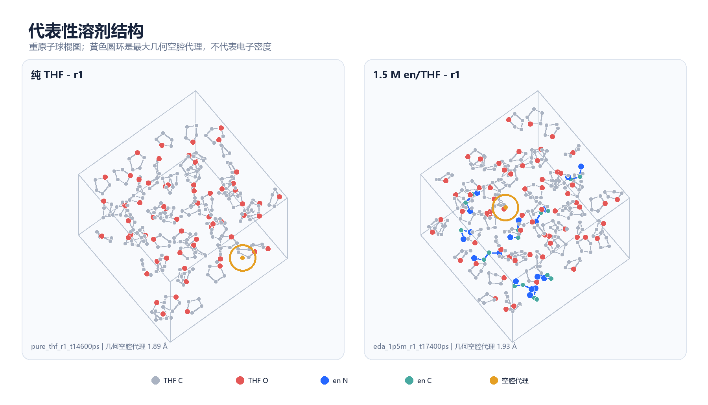

# Stage A solvent report

This directory is the small, shareable data product from the completed Stage A
pilot. It contains all six solvent-only representative snapshots and the
statistics needed to rebuild the Chinese PDF report without access to the HPC
trajectories.

## Direct links

- [Chinese PDF report](stage_a_solvent_report_zh.pdf)
- [Machine-readable metric summary](stage_a_metrics.json)
- [Six-snapshot gallery](figures/stage_a_snapshot_gallery.png)
- [Pure-THF versus EDA/THF structures](figures/stage_a_structures.png)
- [Density and concentration](figures/stage_a_density.png)
- [RDF, contacts, hydrogen bonds, and void proxy](figures/stage_a_microstructure.png)
- [Periodic/non-periodic model boundary](figures/stage_a_model_boundary.png)



## What the pilot represents

The pure system has 64 THF molecules. The mixed system has 64 THF and 9 EDA
molecules, so THF:EDA is 64:9 (7.11:1) and the EDA mole fraction is 12.3%. The
mean NPT volume gives 1.510 M EDA. There is no Li atom and no excess electron in
Stage A.

Each system has three independent 20 ns production replicas. One snapshot per
replica was selected from 10-20 ns with the committed robust-medoid rule. The
yellow rings in the rendered structures mark a heavy-atom geometric void proxy;
they are not electron-density observations.

## Rebuild locally

```bash
python -m pip install -e ".[report]"
python reports/stage_a/build_report.py
```

The builder validates the ready summaries and the SHA-256 provenance recorded
for every analysis, XYZ, and cell file before creating the figures and PDF.

The full production XTC/TPR files remain in HPC storage and are intentionally
not committed. The small CSV/JSON/XYZ exports under `data/` are sufficient to
audit every number and image in this report.
